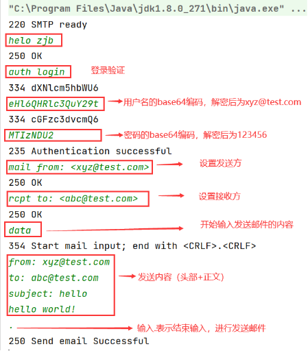

# 邮件系统后端项目

### SMTP服务测试流程

- 启动SpringBootApplication类，启动了服务器和服务器中的SMTP服务
- 进入Client包，启动该包下的SmtpClient，也就是Smtp的客户端测试程序

### SMTP 测试样例

- 在控制台输入红框中的指令：

### POP3服务测试流程

- 启动SpringBootApplication类，启动了服务器和服务器中的POP3服务
- 进入Client包，启动该包下的Pop3Client，也就是POP3的客户端测试程序

### POP3 测试样例

### 查看接口文档

- 启动项目，在浏览器输入地址http://localhost:8080/swagger-ui.html 即可查看接口文档
  
  
